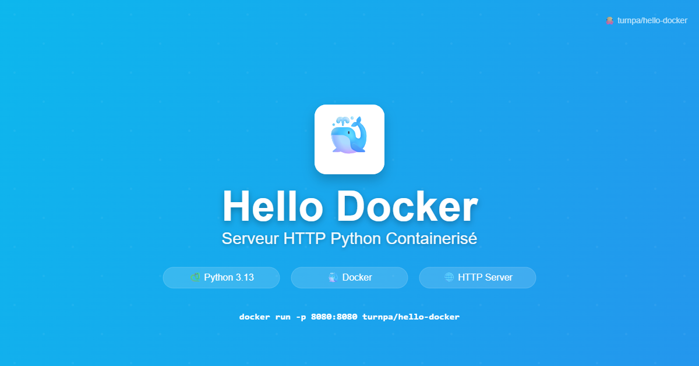

## 📋 Description

Un serveur HTTP simple en Python démontrant les bases de Docker. Ce projet sert une page "Hello Docker!" sur le port 8080 et constitue un excellent exemple pour apprendre la conteneurisation.

## 🚀 Démarrage rapide

### Prérequis
- Docker installé sur votre machine

### Option 1 : Build local

```bash
# Cloner le repository
git clone https://github.com/turnpa/hello-docker.git
cd hello-docker

# Build l'image
docker build -t hello-docker .

# Lancer le conteneur
docker run -p 8080:8080 hello-docker
```

### Option 2 : Depuis Docker Hub

```bash
# Pull et lancer directement
docker run -p 8080:8080 turnpa/hello-docker:latest
```

### ✅ Test

Ouvrez votre navigateur sur [http://localhost:8080](http://localhost:8080) - vous devriez voir **"Hello Docker!"**

## 🐳 Image Docker

- **Base :** Python 3.13.5
- **Taille finale :** ~130MB
- **Port exposé :** 8080
- **Commande :** `python app.py`

## 📁 Structure du projet

```
hello-docker/
├── app.py              # Serveur HTTP Python simple
├── Dockerfile          # Instructions Docker
├── .github/
│   └── assets/
│       └── homelab-logo-dribbble.jpg
└── README.md           # Ce fichier
```

## 🛠️ Code source

### app.py
```python
from http.server import BaseHTTPRequestHandler, HTTPServer

class HelloHandler(BaseHTTPRequestHandler):
    def do_GET(self):
        self.send_response(200)
        self.end_headers()
        self.wfile.write(b"Hello Docker!")

if __name__ == "__main__":
    server = HTTPServer(('0.0.0.0', 8080), HelloHandler)
    print("Server started on port 8080...")
    server.serve_forever()
```

### Dockerfile
```dockerfile
FROM python:3.13.5
WORKDIR /app
COPY app.py .
EXPOSE 8080
CMD ["python", "app.py"]
```

## 🔧 Commandes utiles

```bash
# Build avec un tag spécifique
docker build -t hello-docker:v1.0 .

# Lancer en arrière-plan
docker run -d -p 8080:8080 --name mon-hello hello-docker

# Voir les logs
docker logs mon-hello

# Arrêter le conteneur
docker stop mon-hello

# Supprimer le conteneur
docker rm mon-hello
```

## 📊 Informations techniques

- **Langage :** Python 3.13.5
- **Serveur :** BaseHTTPServer (stdlib)
- **Port :** 8080
- **Réponse :** "Hello Docker!" (plain text)
- **Taille image :** ~130MB

## 🎓 Objectifs pédagogiques

Ce projet démontre :
- ✅ Création d'un Dockerfile simple
- ✅ Build d'une image Docker
- ✅ Exposition d'un port
- ✅ Lancement d'un conteneur
- ✅ Serveur HTTP basique en Python

## 🤝 Contribution

1. Fork le projet
2. Créez une branche (`git checkout -b feature/amelioration`)
3. Commitez vos changements (`git commit -m 'Ajout d'une fonctionnalité'`)
4. Push vers la branche (`git push origin feature/amelioration`)
5. Ouvrez une Pull Request

## 📄 Licence

Ce projet est sous licence MIT.

## 🔗 Liens

- [Repository GitHub](https://github.com/turnpa/hello-docker)
- [Docker Hub](https://hub.docker.com/r/turnpa/hello-docker) *(si publié)*
- [Documentation Docker](https://docs.docker.com/)

---

⭐ **Mettez une étoile si ce projet vous aide à apprendre Docker !**
